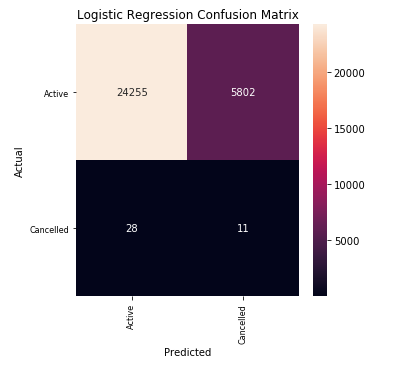
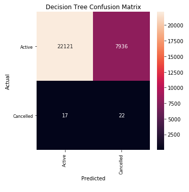
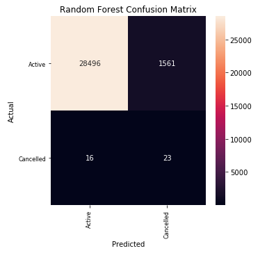
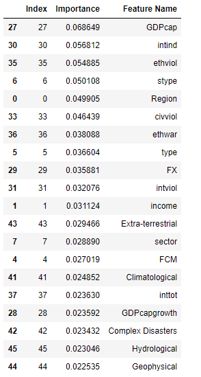
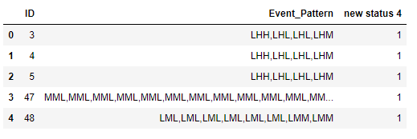
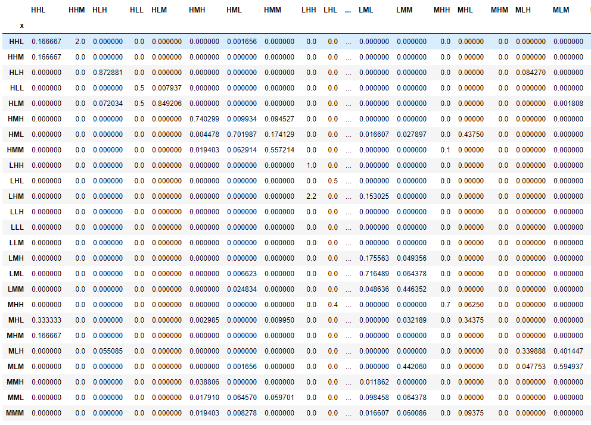

# TDICapstone : Predicting Project Cancellation for Public Private Infrastructure Projects
# Introduction
# Data Description and Ingestion
* [PPI Database](https://ppi.worldbank.org/en/ppidata)
The Private Participation in Infrastructure (PPI) Project Database has data on over 6,400 infrastructure projects in 137 low- and middle-income countries. The database is the leading source of PPI trends in the developing world, covering projects in the energy, transport, water and sewerage, ICT backbone, and Municipal Solid Waste (MSW) sectors (MSW data includes projects since 2008) Projects include management or lease contracts, concessions, greenfield projects, and divestitures.

* [Major Episodes of Systemic Violence](http://www.systemicpeace.org/inscrdata.html)
Center for Systemic Peace, Major Episodes of Political Violence, 1946-2018 (War List), Annual Set lists annual, cross-national, time-series data on interstate, societal, and communal warfare magnitude scores (independence, interstate, ethnic, and civil; violence and warfare) for all countries.

* [EM-DAT International Disaster Database](https://www.emdat.be/)
The Centre for Research on the Epidemiology of Disasters (CRED) launched the Emergency Events Database (EM-DAT). EM-DAT was created with the initial support of the World Health Organisation (WHO) and the Belgian Government.
EM-DAT contains essential core data on the occurrence and effects of over 22,000 mass disasters in the world from 1900 to the present day. The database is compiled from various sources, including UN agencies, non-governmental organisations, insurance companies, research institutes and press agencies.

* [IMF Systemic Banking Crisis Database](https://www.imf.org/en/Publications/WP/Issues/2018/09/14/Systemic-Banking-Crises-Revisited-46232)
 Drawing on 151 systemic banking crises episodes around the globe during 1970-2017, the database includes information on crisis dates, policy responses to resolve banking crises, and the fiscal and output costs of crises.

* [World Bank Global Development Data](https://data.worldbank.org/)
The World Development Indicators is a compilation of relevant, high-quality, and internationally comparable statistics about global development and the fight against poverty. The database contains 1,600 time series indicators for 217 economies and more than 40 country groups, with data for many indicators going back more than 50 years.

* [International Telecommunication Union Country Codes](https://www.itu.int/online/mm/scripts/gensel8)
The radiocommunication division of the International Telecommunication Union uses the following letter codes to identify its member countries.
# Data description
| Variable Name | Variable Description | Type | Missing Values | Imputation | Transformation | Range |
| :- | -: | :-: |:-: |-: | :-: | :-: |
| ID | Project ID | String |0 | None | None | Not Relevant |
| IY | Investment Year | DateTime| 0 | None | None | 1990 to 2019 |
| country | Country | Categorical |  0 | None | OneHot Encode | 127 countries |
| Region | World Bank regional classification | Categorical | 0 | None | OneHot Encode | 6 regions |
| Income | World Bank income classification | Categorical | 0 | None | OneHot Encode | 3 categories |
| IDA | Country eligibility for discounted loans | Categorical | 0 | None | OneHot Encode | 3 categories |
| FCY | Financial Closure Year | DateTime | 0 | None | None | 1990 to 2019 |
| FCM | Financial Closure Month | DateTime | 0 | None | OneHot Encode | January to December |
| type | Type of Project | Categorical | 0 | None | OneHot Encode | 4 categories |
| stype | Sub-ype of Project | Categorical | 0 | None | OneHot Encode | 13 categories |
| status_n | Project status | Categorical | 0 | None | OneHot Encode | 4 categories being merged into 3 |
| DSU | Date of Status Update | DateTime | 0.54 | None | None | Date of info change for record. Unused |
| sector | Sector of project | Categorical | 0 | None | OneHot Encode | 5 sector types. May drop 1 which is a recent classification |
| ssector | Sub-sector of project | Categorical | 0 | None | OneHot Encode | 12 sector types|
| Segment | Further Sub-class of sector | Categorical | 0 | None | OneHot Encode | 33 sector types|
| period | Contract length | Numeric | 0.05 | Median sector values | None | 1 to 99 years. dropping n=1|
| GGC | Govt Granting Contract | Categorical | 0.36 | Undecided | OnehotEncode | 3 categories: Local, State, Federal|
| VDGS | Value of Direct Govt Support | Numerical | 0.99 | Undecided | May add new OneHot for Govt support | Dollar Amounts, Millions USD|
| TIGS | Type of Indirect Govt Support | Categorical | 0.08 | Undecided | OneHot | 6 values. Regex to clean values|
| VIGS | Value of Indirect Govt Support | Numerical | 0.99 | Likely drop | None | Percentages|
| private | Percentage of Private ownership | Numerical | 0.06 | Undecided | None | Percentages|
| fees | Fees paid to the Govt | Numerical | 0.28 | Undecided | None | Millions USD |
| physical | Investment in Physical Infrastructure | Numerical | 0.06 | Undecided | None | Millions USD |
| Investment | Total project Investment | Numerical | 0.16 | Undecided | None | Millions USD |
| capacity | Technical unit of project size | Categorical | 0 | None | OneHot Encode | Units of measurement. 9 types. Not sure if I'll use |
| pcapacity | Project size in technical unit | Numerical | 0.25 | Undecided | None | Not sure if I'll use |
| technol | Type of technology used in Energy projects | Categorical | 0.42 | Undecided | OneHot Encoding | Not sure if I'll use |
| bid_crit | Bidding Criterion | Categorical | 0 | None | OneHot Encoding | 9 categories |
| CAM | Contract Award Method | Categorical | 0.49 | None | OneHot Encoding | 4 categories. Lots of missing data |
| numberb | Number of Bidders | Numerical | 0.77 | None | None | Numerical. Lots of missing data |
| Sponsorinte | Type of Sponsor | Categorical | 0.99 | None | OneHot Encoding | Will drop the column. Lots of missing data |
| Sponsor Country | Country of Sponsor | Categorical | 0.99 | None | OneHot Encoding | Will drop the column. Lots of missing data |
| PRS | Primary Revenue Source | Categorical | 0 | None | OneHot Encoding | 5 categories |
| OSR | Other Source of Revenue | Categorical | 0.95 | None | OneHot Encoding | 5 categories. Lots of missing data. May not use or may combine with Primary Revenue Source |
| BS | Bilateral Support | Text | 0 | None | None | Slightly unstructured text data. Need to use Regex or some other NLP to extract data |
| Description | Unstructured description of project | Text | 0 | None | None | Unstructured text data. May use NLTK/Spacy for text analysis |
| Funding Year | Date of any new injection of capital | DateTime | 0.91 | None | OneHot Encoding | May onehot encode additonal funding vs not |
| Debt | Debt undertaken | Numerical | 0.92 | None | None | Dollar value of debt, millions USD |
| Equity | Value of Equity | Numerical | 0.69 | None | None | Dollar value of Equity, millions USD |
| cdebt | Commercial Debt | Numerical | 0.97 | None | None | Dollar value of Debt, millions USD, Refinement of Debt |
| mdebt | Multilateral Debt | Numerical | 0.99 | None | None | Dollar value of Debt, millions USD, Refinement of Debt |
| bdebt | Bilateral Debt | Numerical | 0.99 | None | None | Dollar value of Debt, millions USD, Refinement of Debt |
| idebt | Institutional Debt | Numerical | 0.99 | None | None | Dollar value of Debt, millions USD, Refinement of Debt |
| pdebt | Public Debt | Numerical | 0.97 | None | None | Dollar value of Debt, millions USD, Refinement of Debt |
| intl_debt | International Debt | Numerical | 0.97 | None | None | Dollar value of Debt, millions USD, Refinement of Debt |
| ldebt | Local Debt | Numerical | 0.96 | None | None | Dollar value of Debt, millions USD, Refinement of Debt. Maybe OneHot Encode type of debt  |
| UP | Unsolicited Proposal | Binary | 0 | None | None | Yes or No  |
| Public Disclosure | Is there public disclosure of contract details | Binary | 0 | None | None | Yes or No  |
| Description of Source | Links of source documents | Text | 0.99 | None | None | Will not use  |
| bordercountries | Number of bordering countries | Numerical | 0 | None | None | Number of border countries  |
| shareborder | Projects across borders | Binary | 0 | None | None | Projects across borders. Less than 0.5% of the sample |
| countrycode | Three Letter countrycode | Categorical | 0 | None | OneHot encoding | May not use it. Country fixed effects are being captured in other confounders anyway |
| region | Three Letter  region code | Categorical | 0 | None | OneHot encoding | Will not use it. Repeated column |
| regionname | Full name of three Letter  region code | Categorical | 0 | None | OneHot encoding | Will not use it. Repeated column |
| adminregion | Three Letter  region code | Categorical | 0 | None | OneHot encoding | Will not use it. Repeated column |
| adminregionname | Full name of three Letter  region code | Categorical | 0 | None | OneHot encoding | Will not use it. Repeated column |
| incomelevel | Three Letter  income level code | Categorical | 0 | None | OneHot encoding | Will not use it. Repeated column |
| incomelevelname | Full name of Three Letter  income level code | Categorical | 0 | None | OneHot encoding | Will not use it. Repeated column |
| lendingtype | Code of loan type | Categorical | 0 | None | OneHot encoding | Will not use it. Repeated column |
| lendingtypename | Full name of loan type | Categorical | 0 | None | OneHot encoding | Will not use it. Repeated column |
| GDP | 2019 GDP | Numerical | 0 | None | None | Will not use it |
| Population | 2019 Population | Numerical | 0 | None | None | Will not use it |
| CPI2019 | 2019 CPI | Numerical | 0 | None | None | Will not use it |
| investment_real | Investment in 2019 dollars | Numerical | 0.16 | None | None | Will use it over nominal numbers|
| realphysicalassets | Physical Assets in 2019 dollars | Numerical | 0.06 | None | None | Will use it over nominal numbers|
| realfeestogovernment | Fees in 2019 dollars | Numerical | 0.28 | None | None | Will use it over nominal numbers|
| name | Project Name | Text | 0 | None | None | Will not use it|
| Renewables | Category of energy projects | Categorical | 0 | None | OneHot Encoeding | May not use it|
| MLS | Multilateral Support | Binary | 0 | None | OneHot Encoeding | Whether a project had support from a Multilateral institution|
| PPP | Whether a project is PPP or not | Binary | 0 | None | OneHot Encoeding | Will use|
| Banking_NPL_To_Total_Gross | Bank nonperforming loans to total gross loans (%) | Numeric | 0.40 | None | None | May use on Trucated dataset of post 2005 data|
| SystBankCrisis | Indicator variable for systemic banking crisis in a country-year | Binary | 0 | None | None | Will use|
| CurrCrisis | Indicator variable for currency crisis in a country-year | Binary | 0 | None | None | Will use|
| SovDebtCrisis | Indicator variable for central govt debt crisis in a country-year | Binary | 0 | None | None | Will use|
| SovDebtRestr | Indicator variable for central govt debt restructuring in a country-year | Binary | 0 | None | None | Will use|
| BizDisclIndex | Business Extent of Disclosure Index | Ordinal | 0.28 | TBD | OneHot | Will use|
| TimeBizStart | Days required to start a business | Numerical | 0.47 | None | None | May use for truncated dataset|
| CredtoPvt | Domestic Credit to Pvt Sector (% of GDP) | Numerical | 0.08 | TBD | None | Will use|
| CurrAccBal | Current Account Balance (current USD) | Numerical | 0.01 | None | None | Will use|
| EmptoPop | Employment to population ratio (%) | Numerical | 0 | None | None | Will use|
| FDI | Foreign Direct Investment (current USD) | Numerical | 0 | None | None | Will use|
| CC3 | Three letter Country Code | Categorical | 0 | None | None | Repeated. Will be dropped|
| Banking Crisis | Indicator variable | Binary | 0.28 | None | None | HBS data. IMF data is better. This will be dropped|
| Systemic Crisis | Indicator variable | Binary | 0.28 | None | None | HBS data. IMF data is better. This will be dropped|
| Domestic_debt_in_default | Indicator variable | Binary | 0.28 | None | None | HBS data. IMF data is better. This will be dropped|
| Currency Crisis | Indicator variable | Binary | 0.23 | None | None | HBS data. IMF data is better. This will be dropped|
| Inflation Crisis | Indicator variable | Binary | 0.24 | None | None | HBS data. WB data is better. This will be dropped|
| FX | FX Rates wrt USD | Numerical | 0 | None | None | Will keep. Will add column on percentage changes|
| GDPcap | GDP per capita (current USD) | Numerical | 0 | None | None | Will keep|
| GDPcapgrowth | GDP per capita growth (%) | Numerical | 0 | None | None | Will keep|
| GDPgrowth | GDP growth (%) | Numerical | 0 | None | None | Will keep|
| Total private debt, all instruments(percent of GDP) | Total private debt, all instruments(% of GDP)| Numerical | 0.85 | None | None | Insufficient data. Will not use|
| Total private debt,loans and debt securities (percent of GDP) | Total private debt, loans and debt securities(% of GDP)| Numerical | 0.06 | None | None | Will use. Imputation to be considered|
| Household debt, loans and debt securities (percent of GDP) | Household debt, loans and debt securities(% of GDP)| Numerical | 0.23 | None | None | May use on truncated dataset. Imputation to be considered|
| Non-financial corporations debt, loans and debt securities, loans and debt securities (percent of GDP) | Non-financial corporations debt, loans and debt securities, loans and debt securities(% of GDP)| Numerical | 0.23 | None | None | May use on truncated dataset. Imputation to be considered|
| General government debt (percent of GDP) | General government debt (percent of GDP)| Numerical | 0.31 | None | None | May use on truncated dataset. Imputation to be considered|
| Central government debt (percent of GDP) | General government debt (percent of GDP)| Numerical | 0.20 | None | None | May use on truncated dataset. Imputation to be considered|
| IndustryValAdd | Industry (including construction), value added (% of GDP)| Numerical | 0.006 | None | None | Will use|
| Inflation | Inflation (%)| Numerical | 0.10 | TBD | None | Will use|
| IRspread | Interest Rate Spread (%)| Numerical | 0.24 | TBD | None | Will use for truncated dataset|
| LegalRights | Strength of Legal Rights| Ordinal | 0.64 | TBD | None | May use for truncated dataset with some imputation|
| LendingRiskPrem | Risk premium on lending (lending rate minus treasury bill rate, %)| Numerical | 0.59 | TBD | None | May use for truncated dataset with some imputation|
| Biological | Number of biological disasters in country-year| Numerical | 0 | TBD | None | Need to replace nan with 0|
| Climatological | Number of climate disasters in country-year| Numerical | 0 | TBD | None | Need to replace nan with 0|
| ComplexDisasters | Number of complex disasters in country-year| Numerical | 0 | TBD | None | Need to replace nan with 0|
| Extra-terrestrial | Number of extra-terrestial disasters in country-year| Numerical | 0 | TBD | None | Need to replace nan with 0|
| Geophysical | Number of geophysical disasters in country-year| Numerical | 0 | TBD | None | Need to replace nan with 0|
| Hydrological | Number of Hydrological disasters in country-year| Numerical | 0 | TBD | None | Need to replace nan with 0|
| Meteorological | Number of Meteorological disasters in country-year| Numerical | 0 | TBD | None | Need to replace nan with 0|
| Technological | Number of Technological disasters in country-year| Numerical | 0 | TBD | None | Need to replace nan with 0|
| Natural Disaster Total | Natural Disaster Total in country-year| Numerical | 0 | TBD | None | Need to replace nan with 0|
| NetODAGNI | Donor Assistance as % of GNI| Numerical | 0.07 | TBD | None | Will use, may do some imputation|
| PopGrowth | Population Growth Rate %| Numerical | 0.006 | TBD | None | Will use, may do some imputation|
| Population | Population | Numerical | 0.00067 | TBD | None | Will use, may do some imputation|
| PubSectMgmt | CPIA Public Sector Management Score (1=low to 6=high) | Ordinal | 0.88 | TBD | Ordinal | Only available after 2005 may do some imputation or may only use on truncated dataset|
| RealIR | Real interest rate | Numerical | 0.149 | TBD | None | May use imputation or use on truncated dataset|
| StartupProcs | Start-up procedures to register a business (number) | Numerical | 0.47 | TBD | None | May use imputation or use on truncated dataset. Data available from 2005|
| TotalDebtService | Total debt service (% of exports of goods, services and primary income) | Numerical | 0.04 | TBD | None | May perform some imputation|
| TotalReserves | Total reserves (includes gold, current US$)| Numerical | 0.0146 | TBD | None | May perform some imputation|
| Unemployment | Unemployment Rate| Numerical | 0.004 | TBD | None | May perform some imputation|
| Score-Starting a business | Ease of starting a business (0=low to 100=high)| Numerical/Categorical | 0.256 | TBD | None | May use imputation or use on truncated dataset. Data available from 2005|
| Score-Paid-in Minimum capital (of income per capita) | Paid-in minimum capital requirement reflects the amount that the entrepreneur needs to deposit in a bank or with a third-party before registration or up to three months after incorporation(\% of per capita income) | Numerical | 0.255 | TBD | None | May use imputation or use on truncated dataset. Data available from 2005|
| Score-Procedures (number) | The score for the number procedures benchmarks economies with respect to the regulatory best practice  (0=low to 100=high)| Numerical/Categorical | 0.327 | TBD | None | May use imputation or use on truncated dataset. Data available from 2005|
| Score-Time (days) | The score for time benchmarks economies with respect to the regulatory best practice  (0=low to 100=high)| Numerical/Categorical | 0.327 | TBD | None | May use imputation or use on truncated dataset. Data available from 2005|
| Score-Cost (\% of Warehouse value) | The score for all official costs associated with completing the procedures to legally build a warehouse  (0=low to 100=high)| Numerical/Categorical | 0.327 | TBD | None | May use imputation or use on truncated dataset. Data available from 2005|
| Score-Cost (\% of property value) | The score for total of official costs associated with completing the procedures to transfer the property  (0=low to 100=high)| Numerical/Categorical | 0.29 | TBD | None | May use imputation or use on truncated dataset. Data available from 2005|

# Data Exploration

# Modeling Approach
I am following two modelling approaches.
## Path Independence
 In the first approach I assume path independence and assume that the confounder variables from the previous year have all relevant information. For instance, consider the following raw data:
 
 Here we have two projects. One project stays alive and is successfully concluded when the contract ends. The second project gets cancelled into the third year of its contract. I convert these two data points into 7 data points. The first project converts into 3 data points where it is alive in two years and dead in the third. The second project converts into four data points, one for each year in its contracted period where the project was alive. In the original data set, 1.2% of the projects get cancelled. After exploding the dataset in this fashion, 0.23% of the data represents cancelled projects.

 

 For the path independence approach, I employ a Logistic Classifier, a Decision Tree, and Random Forest Classifier.

## Path Dependency
Every project has two types of information about it, static information that does not change with time and dynamic information which changes with time. I first cluster the data into three clusters based on static information such as contract details and other information about sector, region, and other confounders which are constant for a project and do not change with time. Within each cluster I develop a Markov Classifier. The Markov states are defined by the dynamic confounder variables. I use PCA to reduce the number of dynamic confounders to three and then discretize them into three cuts each to get a 27 valued state variable for each cluster. I then construct a 27x27 transition matrix. I create one transition matrix for the successful projects and one transition matrix for the projects which get cancelled. Then for a given project, I first place it into the appropriate cluster and then within a cluster I classify the project to be successful or failure depending on maximizing the likelihood of the project dynamic variable path resulting from either the successful project transition matrix or the cancelled project transition matrix.   
## Main Modelling Challenges
### Unbalanced Classes
The data is divided into two classes, the projects which get cancelled and those which are not. The cancelled projects are 1 in a 1000 in my dataset. I employ SMOTE, Synthetic Minority Oversampling techniques to address the issue of  unbalanced classes.
### Missing Data
There are a lot of missing data in terms of contract details and confounder variables. Please see the section on data description above. I kept variables where less than 1% of the data was missing and then imputed data based on appropriate logic such as regional medians, sector medians etc.
### Absence of Project Level Dynamic Data
The biggest shortcoming of this study is that we do not have any project specific time-varying dynamic data. The only project specific data I have is static data on contract details. In the future, this study can be expanded to include time-varying project level data, including satellite data of project site, any period publicly disclosed financial reporting data, and other project specific data from twitter or other sources.
## Feature Engineering
## Logistic Regression Modeling

## Decision Tree Modeling

## Random Forest Classifier

## Markov Chain Classifier

## Conclusion and Future Work
