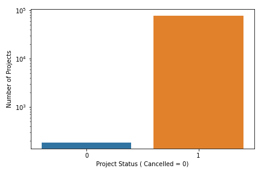
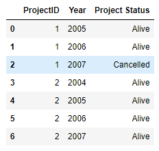

# TDICapstone : Predicting Project Cancellation for Public Private Infrastructure Projects
# Introduction
# Data Description and Ingestion
* [PPI Database](https://ppi.worldbank.org/en/ppidata)
The Private Participation in Infrastructure (PPI) Project Database has data on over 6,400 infrastructure projects in 137 low- and middle-income countries. The database is the leading source of PPI trends in the developing world, covering projects in the energy, transport, water and sewerage, ICT backbone, and Municipal Solid Waste (MSW) sectors (MSW data includes projects since 2008) Projects include management or lease contracts, concessions, greenfield projects, and divestitures.

* [Major Episodes of Systemic Violence](http://www.systemicpeace.org/inscrdata.html)
Center for Systemic Peace, Major Episodes of Political Violence, 1946-2018 (War List), Annual Set lists annual, cross-national, time-series data on interstate, societal, and communal warfare magnitude scores (independence, interstate, ethnic, and civil; violence and warfare) for all countries.

* [EM-DAT International Disaster Database](https://www.emdat.be/)
The Centre for Research on the Epidemiology of Disasters (CRED) launched the Emergency Events Database (EM-DAT). EM-DAT was created with the initial support of the World Health Organisation (WHO) and the Belgian Government.
EM-DAT contains essential core data on the occurrence and effects of over 22,000 mass disasters in the world from 1900 to the present day. The database is compiled from various sources, including UN agencies, non-governmental organisations, insurance companies, research institutes and press agencies.

* [IMF Systemic Banking Crisis Database](https://www.imf.org/en/Publications/WP/Issues/2018/09/14/Systemic-Banking-Crises-Revisited-46232)
 Drawing on 151 systemic banking crises episodes around the globe during 1970-2017, the database includes information on crisis dates, policy responses to resolve banking crises, and the fiscal and output costs of crises.

* [World Bank Global Development Data](https://data.worldbank.org/)
The World Development Indicators is a compilation of relevant, high-quality, and internationally comparable statistics about global development and the fight against poverty. The database contains 1,600 time series indicators for 217 economies and more than 40 country groups, with data for many indicators going back more than 50 years.

* [International Telecommunication Union Country Codes](https://www.itu.int/online/mm/scripts/gensel8)
The radiocommunication division of the International Telecommunication Union uses the following letter codes to identify its member countries.
# Data Exploration

# Modeling Approach
I am following two modelling approaches.
## Path Independence
 In the first approach I assume path independence and assume that the confounder variables from the previous year have all relevant information. For instance, consider the following raw data:
 
 Here we have two projects. One project stays alive and is successfully concluded when the contract ends. The second project gets cancelled into the third year of its contract. I convert these two data points into 7 data points. The first project converts into 3 data points where it is alive in two years and dead in the third. The second project converts into four data points, one for each year in its contracted period where the project was alive. In the original data set, 1.2% of the projects get cancelled. After exploding the dataset in this fashion, 0.23% of the data represents cancelled projects.

 For the path independence approach, I employ a Logistic Classifier, a Decision Tree, and Random Forest Classifier.
 
## Path Dependency
Every project has two types of information about it, static information that does not change with time and dynamic information which changes with time. I first cluster the data into three clusters based on static information such as contract details and other information about sector, region, and other confounders which are constant for a project and do not change with time. Within each cluster I develop a Markov Classifier. The Markov states are defined by the dynamic confounder variables. I use PCA to reduce the number of dynamic confounders to three and then discretize them into three cuts each to get a 27 valued state variable for each cluster. I then construct a 27x27 transition matrix. I create one transition matrix for the successful projects and one transition matrix for the projects which get cancelled. Then for a given project, I first place it into the appropriate cluster and then within a cluster I classify the project to be successful or failure depending on maximizing the likelihood of the project dynamic variable path resulting from either the successful project transition matrix or the cancelled project transition matrix.   
## Main Modelling Challenges
### Unbalanced Classes
The data is divided into two classes, the projects which get cancelled and those which are not. The cancelled projects are 1 in a 1000 in my dataset. I employ SMOTE, Synthetic Minority Oversampling techniques to address the issue of  unbalanced classes.
### Missing Data
There are a lot of missing data in terms of contract details and confounder variables. Please see the section on data description above. I kept variables where less than 1% of the data was missing and then imputed data based on appropriate logic such as regional medians, sector medians etc.
### Absence of Project Level Dynamic Data
The biggest shortcoming of this study is that we do not have any project specific time-varying dynamic data. The only project specific data I have is static data on contract details. In the future, this study can be expanded to include time-varying project level data, including satellite data of project site, any period publicly disclosed financial reporting data, and other project specific data from twitter or other sources.
## Feature Engineering
## Logistic Regression Modeling

## Decision Tree Modeling

## Random Forest Classifier

## Markov Chain Classifier

## Conclusion and Future Work
